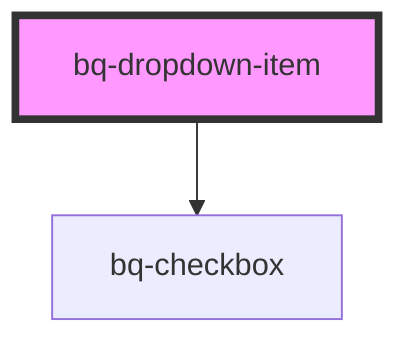

# bq-dropdown-item

<!-- Auto Generated Below -->

## Properties

| Property   | Attribute  | Description                                                           | Type      | Default |
| ---------- | ---------- | --------------------------------------------------------------------- | --------- | ------- |
| `checked`  | `checked`  | Relevant only if multiple` attr is true; if true, checkbox is checked | `boolean` | `false` |
| `disabled` | `disabled` | If true, the dropdown item is disabled                                | `boolean` | `false` |
| `multiple` | `multiple` | If true, display <bq-checkbox>                                        | `boolean` | `false` |

## Events

| Event                   | Description                                | Type                                     |
| ----------------------- | ------------------------------------------ | ---------------------------------------- |
| `bqDropdownItemBlur`    | Handler to be called when item loses focus | `CustomEvent<HTMLBqDropdownItemElement>` |
| `bqDropdownItemClick`   | Handler to be called when item is clicked  | `CustomEvent<HTMLBqDropdownItemElement>` |
| `bqDropdownItemFocus`   | Handler to be called when item is focused  | `CustomEvent<HTMLBqDropdownItemElement>` |
| `bqDropdownItemOnEnter` | Handler to be called on enter key press    | `CustomEvent<HTMLBqDropdownItemElement>` |

## Shadow Parts

| Part       | Description |
| ---------- | ----------- |
| `"label"`  |             |
| `"prefix"` |             |
| `"suffix"` |             |

## Dependencies

### Depends on

- [bq-checkbox](../checkbox)

### Graph

----------------------------------------------

*Built with [StencilJS](https://stenciljs.com/)*
